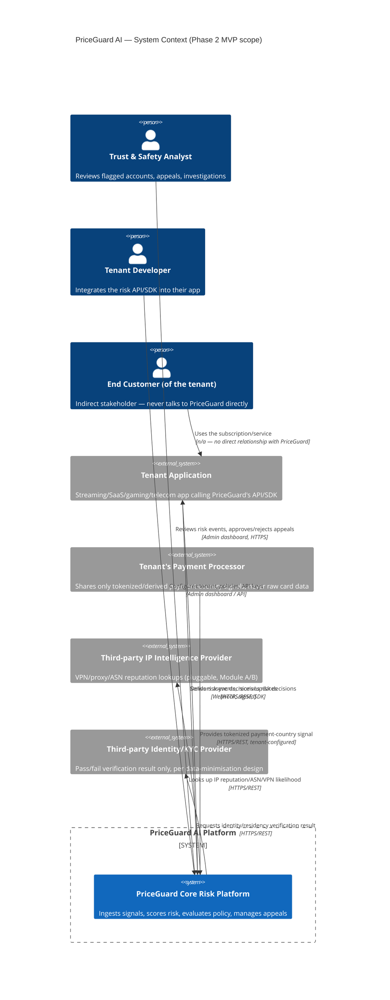
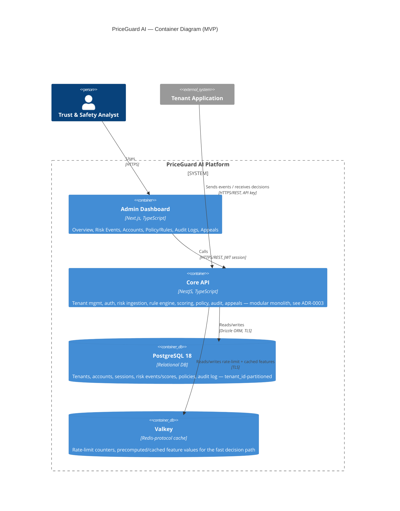

# C4 Diagrams — Level 1 (Context) & Level 2 (Container)

Rendered as Mermaid; paste into any Mermaid-capable viewer (Confluence's Mermaid macro,
GitHub's native Mermaid rendering, or `docs/confluence/` exports).

## Level 1 — System Context

## Level 2 — Containers (Phase 2 MVP)

## Phase 3 addition: batch feature store

`account_feature_snapshots` (`apps/api/src/analytics/feature-store.service.ts`) is a
**batch** feature store — a nightly job aggregating `risk_events`/`sessions`/`risk_scores`
into per-account daily snapshots — not the streaming Feature Store container originally
scoped for Phase 3. A real streaming platform (Kafka-compatible event stream feeding a
columnar analytics store such as ClickHouse) remains deferred until real ingestion volume
justifies the operational cost (ADR-0002, Phase 0 §M/N); this batch implementation is what
Phase 4's model training reads from in the meantime.

## Phase 4 addition: in-process ML module (not a separate service)

`apps/api/src/ml/` implements the shadow-model training/registry/evaluation/drift/rollout-
approval pipeline **in-process**, not as the separate ML Scoring Service (Python/FastAPI)
container originally scoped — see ADR-0006 for the full reasoning and, importantly, what
is explicitly *not* real yet (the approved rollout does not gate live traffic; the trained
model is illustrative-scale, not production-grade fraud ML).

## Phase 5 addition: fraud graph on Postgres (not a dedicated graph DB)

`apps/api/src/fraud-graph/` implements real connected-components clustering directly over
Postgres (`devices`/`device_account_links`/`payment_signals`) rather than the dedicated
Graph Database container originally scoped — see ADR-0007 for the full reasoning, the real
gap it found and fixed (`device_account_links`), and what's explicitly deferred (clusters
don't yet feed policy decisions; no fuzzy/similarity matching; no dedicated graph engine).

## Phase 6 addition: OIDC SSO, fine-grained RBAC, DSAR export, session revocation

`apps/api/src/sso/`, `src/rbac/`, `src/dsr/export.service.ts` — see ADR-0008 for what's
genuinely tested (a real fake-but-spec-compliant OIDC provider, not a live vendor IdP) and
what's explicitly deferred (SAML, MFA; the SSO callback returns JSON, not yet a browser
redirect into the dashboard SPA).

## Phase 7 addition: client SDKs (Node, Python) wrapping the ingestion endpoint

`sdk/node/` (`@priceguard/sdk-node`) and `sdk/python/` (`priceguard-sdk`) are thin typed
clients for `POST /v1/risk/events` — no new container, no new API surface, just first-party
client libraries a tenant's own application process calls into (replacing the `tenantApp`
box's own hand-rolled HTTP calls in the Level 1 diagram above). See ADR-0009 for what's
genuinely tested (a real, running instance of the API, not just stubbed HTTP) and what's
explicitly deferred (not OpenAPI-generated, not published to a registry, only two
languages, no retry/batching).

## Not yet in scope (roadmap context only)

Event Stream (Kafka-compatible, still deferred per ADR-0002) is still deliberately
**absent** from the container diagram above. It will be added to this document, not
silently introduced into code, when its phase begins.
