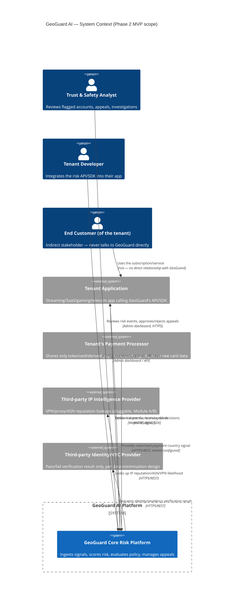

# C4 Diagrams — Level 1 (Context) & Level 2 (Container)

Rendered as Mermaid; paste into any Mermaid-capable viewer (Confluence's Mermaid macro,
GitHub's native Mermaid rendering, or `docs/confluence/` exports).

## Level 1 — System Context

## Level 2 — Containers (Phase 2 MVP)

## Not yet in scope (Phase 3–5 containers, shown for roadmap context only)

Feature Store, Event Stream (Kafka-compatible), ML Scoring Service (Python/FastAPI),
Model Registry, Graph Database (fraud graph) are deliberately **absent** from the MVP
container diagram above — see ADR-0002 and Phase 0 §M/N. They will be added to this
document, not silently introduced into code, when their phase begins.
