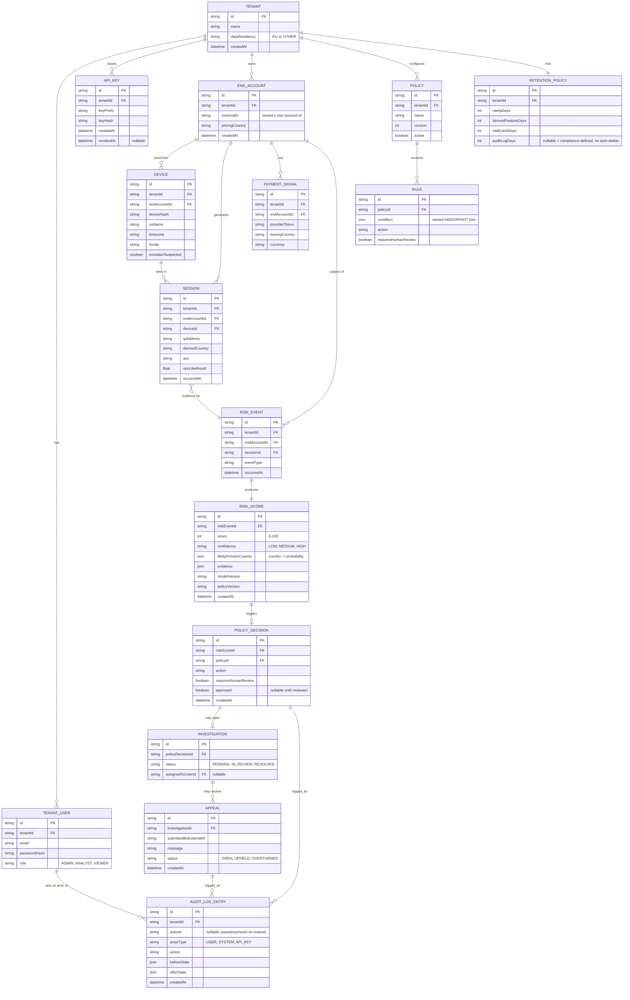

# Entity-Relationship Diagram — Phase 2 MVP

Source of truth is `apps/api/prisma/schema.prisma`; this diagram is a human-readable view
of it and must be kept in sync (`CONTRIBUTING.md`).

```mermaid
erDiagram
    TENANT ||--o{ TENANT_USER : has
    TENANT ||--o{ API_KEY : issues
    TENANT ||--o{ END_ACCOUNT : owns
    TENANT ||--o{ POLICY : configures
    TENANT ||--|| RETENTION_POLICY : has
    END_ACCOUNT ||--o{ DEVICE : "used from"
    END_ACCOUNT ||--o{ SESSION : generates
    END_ACCOUNT ||--o{ PAYMENT_SIGNAL : has
    END_ACCOUNT ||--o{ RISK_EVENT : "subject of"
    DEVICE ||--o{ SESSION : "seen in"
    SESSION }o--|| RISK_EVENT : "evidence for"
    RISK_EVENT ||--|| RISK_SCORE : produces
    RISK_SCORE ||--o| POLICY_DECISION : triggers
    POLICY ||--o{ RULE : contains
    POLICY_DECISION ||--o| INVESTIGATION : "may open"
    INVESTIGATION ||--o{ APPEAL : "may receive"
    POLICY_DECISION ||--o{ AUDIT_LOG_ENTRY : logged_as
    APPEAL ||--o{ AUDIT_LOG_ENTRY : logged_as
    TENANT_USER ||--o{ AUDIT_LOG_ENTRY : "acts as actor of"

    TENANT {
        string id PK
        string name
        string dataResidency "EU or OTHER"
        datetime createdAt
    }
    TENANT_USER {
        string id PK
        string tenantId FK
        string email
        string passwordHash
        string role "ADMIN, ANALYST, VIEWER"
    }
    API_KEY {
        string id PK
        string tenantId FK
        string keyPrefix
        string keyHash
        datetime createdAt
        datetime revokedAt "nullable"
    }
    END_ACCOUNT {
        string id PK
        string tenantId FK
        string externalId "tenant's own account id"
        string pricingCountry
        datetime createdAt
    }
    DEVICE {
        string id PK
        string tenantId FK
        string endAccountId FK
        string deviceHash
        string osName
        string timezone
        string locale
        boolean emulatorSuspected
    }
    SESSION {
        string id PK
        string tenantId FK
        string endAccountId FK
        string deviceId FK
        string ipAddress
        string derivedCountry
        string asn
        float vpnLikelihood
        datetime occurredAt
    }
    PAYMENT_SIGNAL {
        string id PK
        string tenantId FK
        string endAccountId FK
        string providerToken
        string issuingCountry
        string currency
    }
    RISK_EVENT {
        string id PK
        string tenantId FK
        string endAccountId FK
        string sessionId FK
        string eventType
        datetime occurredAt
    }
    RISK_SCORE {
        string id PK
        string riskEventId FK
        int score "0-100"
        string confidence "LOW, MEDIUM, HIGH"
        json likelyPrimaryCountry "country -> probability"
        json evidence
        string modelVersion
        string policyVersion
        datetime createdAt
    }
    POLICY {
        string id PK
        string tenantId FK
        string name
        int version
        boolean active
    }
    RULE {
        string id PK
        string policyId FK
        json condition "nested AND/OR/NOT tree"
        string action
        boolean requiresHumanReview
    }
    POLICY_DECISION {
        string id PK
        string riskScoreId FK
        string policyId FK
        string action
        boolean requiresHumanReview
        boolean approved "nullable until reviewed"
        datetime createdAt
    }
    INVESTIGATION {
        string id PK
        string policyDecisionId FK
        string status "PENDING, IN_REVIEW, RESOLVED"
        string assignedToUserId FK "nullable"
    }
    APPEAL {
        string id PK
        string investigationId FK
        string submittedByExternalId
        string message
        string status "OPEN, UPHELD, OVERTURNED"
        datetime createdAt
    }
    AUDIT_LOG_ENTRY {
        string id PK
        string tenantId FK
        string actorId "nullable, pseudonymised on erasure"
        string actorType "USER, SYSTEM, API_KEY"
        string action
        json beforeState
        json afterState
        datetime createdAt
    }
    RETENTION_POLICY {
        string id PK
        string tenantId FK
        int rawIpDays
        int derivedFeatureDays
        int riskEventDays
        int auditLogDays "nullable = compliance-defined, no auto-delete"
    }
```
