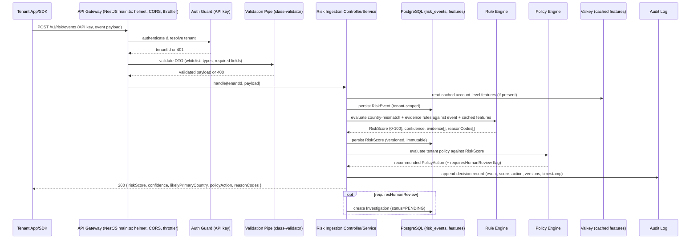

# Data Flow Diagram — Risk Event Lifecycle (MVP)

## Notes

- The **fast path** shown above uses only cached/precomputed features and rule evaluation —
  no synchronous call to any ML model or third-party enrichment API blocks the response
  (Phase 0 §29 latency requirement). Any expensive enrichment (IP-intelligence provider
  lookup) that the MVP does perform is invoked once per new IP and its result cached, not
  repeated per event.
- Internal analyst-facing evidence (full feature values, exact thresholds) and the
  customer-facing explanation returned in the API response are **rendered from the same
  evidence record through two different serializers** (`InternalExplanationSerializer` vs
  `CustomerExplanationSerializer`) so the detailed mechanism is never leaked to the tenant's
  own end users through the API response, per brief §18.
- Asynchronous paths (analytics aggregation, model training, fraud graph) are explicitly
  out of MVP scope (see ADR-0002) and are not drawn here to avoid documenting containers
  that do not exist yet.
